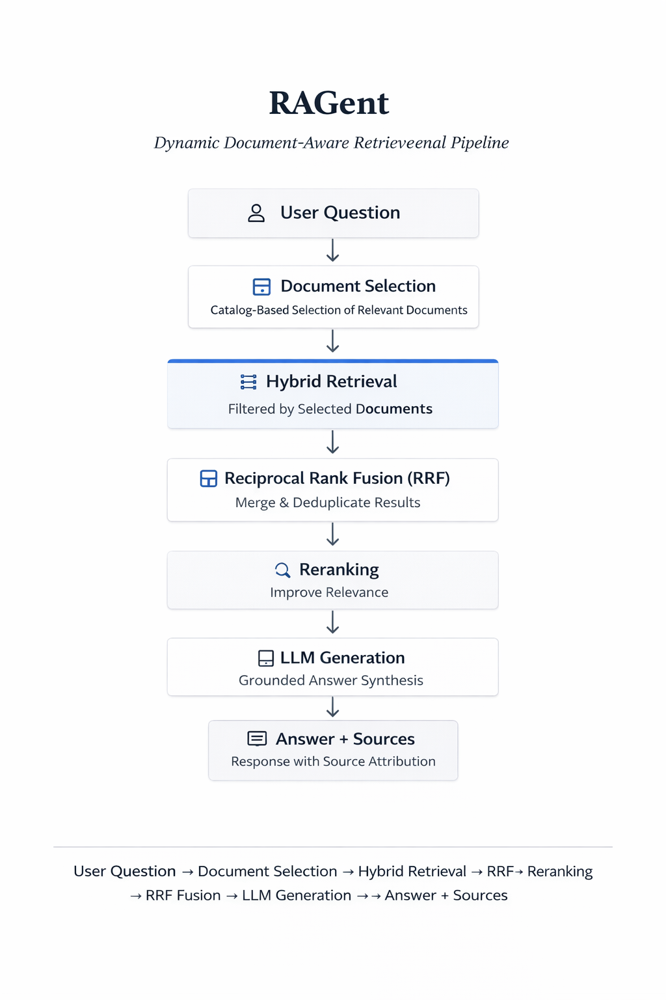

# RAGent

RAGent is a retrieval-first backend that answers questions strictly from ingested documents.

It uses hybrid retrieval, dynamic document selection, and grounded generation to produce source-backed answers.

## Pipeline

  

## Key Features

- **Dynamic document selection** — automatically selects relevant documents from a catalog  
- **Hybrid retrieval** — combines semantic search (vector) and keyword search (BM25)  
- **Reranking** — improves relevance before generation  
- **Grounded answers** — responses include source attribution  
- **Document catalog** — enables scalable document lookup  
- **Ingestion safety** — prevents duplicates via hashing  
- **Evaluation suite** — tests routing, grounding, and sources  

## Architecture

The system follows a retrieval-first architecture:

    app/
    ├── api/            FastAPI endpoints
    ├── embeddings/     Embedding interface
    ├── ingestion/      Document chunking and preprocessing
    ├── llm/            LLM client
    ├── orchestration/  Planner and routing logic
    ├── rag/            Retrieval and generation pipeline
    ├── vectordb/       ChromaDB integration
    └── utils/          Shared utilities

    frontend/
    └── app.py          Streamlit frontend

### Top-level files

    eval_cases.json     Evaluation test cases
    run_eval.py         Automated evaluation script
    requirements.txt    Project dependencies
    README.md

### `POST /ask`
Single-document query.

### `POST /ask_routed`
Query with dynamic document selection and routing.

### `GET /documents`
List all documents.

### `GET /documents/{document_id}`
Get document chunks.

## Running the Project

### 1. Install dependencies

    pip install -r requirements.txt

### 2. Start the FastAPI backend

    python -m uvicorn app.api.main:app --reload

Backend: `http://127.0.0.1:8000`  
Interactive API docs: `http://127.0.0.1:8000/docs`

### 3. Start the Streamlit frontend

    python -m streamlit run frontend/app.py

Frontend: `http://localhost:8501`

## Frontend

- Ask questions  
- Ingest documents  
- Browse knowledge base  

## Evaluation

Run the evaluation suite with:

    python run_eval.py

Checks routing, grounding, and source attribution.

## Limitations

- keyword-based document selection  
- heuristic reranking  
- no document update/delete  
- limited frontend diagnostics  

## Future Improvements

- semantic document selection  
- better reranking (cross-encoders)  
- query rewriting  
- streaming responses  
- document management  

## License

MIT License
