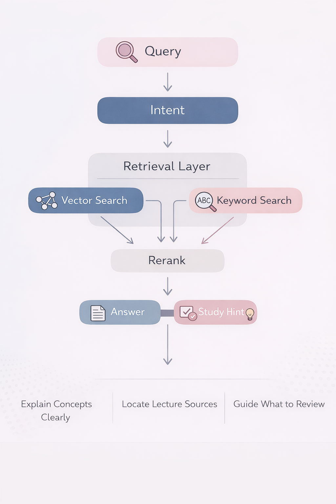

# Recall

Recall is a retrieval-first study memory system designed to help students revisit, understand, and reinforce knowledge from their own lecture materials.

Instead of only answering questions, Recall focuses on:

- explaining concepts clearly  
- locating where topics were originally covered  
- guiding what to review next  

All responses are strictly grounded in retrieved sources.

## Pipeline

## Pipeline

  

## Key Features

- **Intent-based responses** — adapts answers based on study intent (explanation, recall, revision)
- **Global hybrid retrieval** — searches across all materials using semantic + keyword search
- **Reranking** — prioritizes the most relevant content
- **Grounded answers** — all responses are based only on retrieved sources
- **Study guidance** — suggests what to review next (`study_hint`)
- **Metadata-aware ingestion** — supports course and topic-based organization
- **Typed pipeline (Pydantic)** — structured data across all stages

## Architecture

The system follows a retrieval-first architecture:

    app/
    ├── api/            FastAPI endpoints
    ├── embeddings/     Embedding interface
    ├── ingestion/      Document chunking and preprocessing
    ├── llm/            LLM client
    ├── orchestration/  Intent classification and query handling
    ├── rag/            Retrieval and generation pipeline
    ├── schemas/        Shared Pydantic models (API, retrieval, routing)
    ├── vectordb/       ChromaDB integration
    └── utils/          Shared utilities

    frontend/
    └── app.py          Streamlit frontend

### Top-level files

    eval_cases.json     Evaluation test cases
    run_eval.py         Automated evaluation script
    requirements.txt    Project dependencies
    README.md

### `POST /ask`
Single-document query.

### `POST /ask_routed`
Query with dynamic document selection and routing.

### `GET /documents`
List all documents.

### `GET /documents/{document_id}`
Get document chunks.

## Running the Project

### 1. Install dependencies

    pip install -r requirements.txt

### 2. Start the FastAPI backend

    python -m uvicorn app.api.main:app --reload

Backend: `http://127.0.0.1:8000`  
Interactive API docs: `http://127.0.0.1:8000/docs`

### 3. Start the Streamlit frontend

    python -m streamlit run frontend/app.py

Frontend: `http://localhost:8501`

## Study Intents

Recall classifies each query into a study intent:

- **concept_explanation** — explain a concept clearly  
- **source_recall** — locate where something was covered  
- **exam_preparation** — identify what to review  
- **unknown** — fallback when intent is unclear  

This allows the system to adapt how answers are generated.

## Response Format

Each response includes:

- **answer** — grounded explanation  
- **sources** — retrieved supporting chunks  
- **study_hint** — suggestion on what to review next  

Example:

"Review these lecture notes to reinforce the concept: db_lecture_1, db_lecture_2"

## Limitations

- keyword-based document selection  
- heuristic reranking  
- no document update/delete  
- limited frontend diagnostics  

## Future Improvements

- semantic document selection  
- better reranking (cross-encoders)  
- query rewriting  
- streaming responses  
- document management  

## License

MIT License
